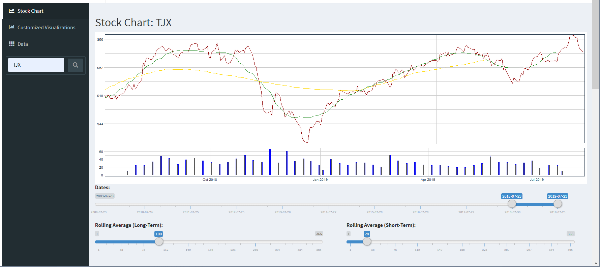
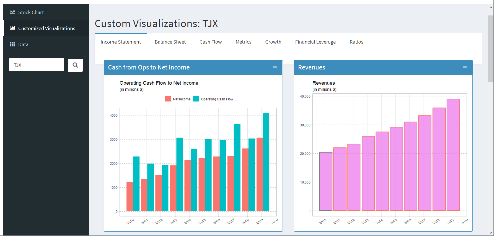
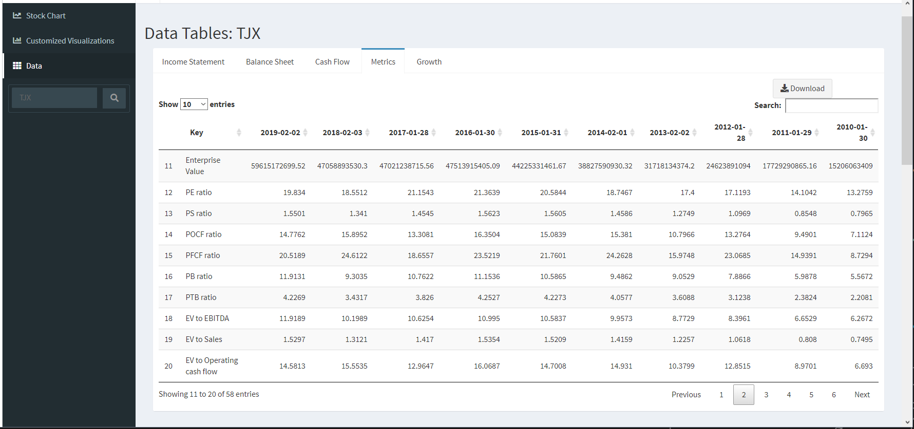

# dashboard
This dashboard attempts to automate the tedious process of using Excel to organize and calculate various metrics (as shown on this [spreadsheet](../images/excel_sheet.jpg)), as well as visualize the data by manually creating charts and graphs (as shown in this [image](../images/excel_graphs.jpg)).

The user types the ticker symbol he wishes to investigate into the search bar on the left and clicks the search button. The app will download data from the web on an as-needed basis in order to populate the main body with content. The "Stock Chart" tab shows a basic chart of the stock's price history, with a few customizable inputs such as date range and rolling averages. The "Customized Visualizations" tab is a place to automatically visualize the many metrics and figures in the data. The "Data" tab displays the raw data sets in explorable tables, with a download button if the user wishes to conveniently save the current data table as a csv file. 

This app is a rough draft and is currently incomplete. Additional features, orginization, and fine-tuning may be included at later times.

